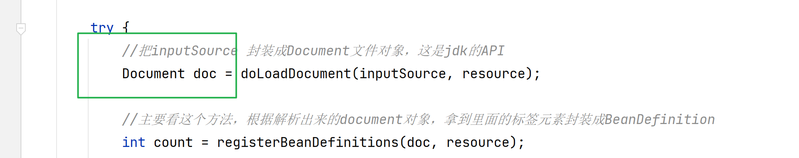

### 12-07 Spring源码编译和xml解析

#### 1、spring为什么学  

1. 其他框架用到了，比如：如果使用netty,会使用到spring
2. 代码更加优雅，体现程序员功力，不喜欢屎山
3. 面试需要

#### 2、编译-代码

​     spring源码工程中也用到了 命令 bat

​       <spring.version>5.2.8.RELEASE</spring.version> ------源码版本

#### 3、代码分析

http://117.33.237.52:20070/desperado-image/xml%E8%A7%A3%E6%9E%90%E5%92%8CBeanDefinition%E5%B0%81%E8%A3%85%E6%A0%B8%E5%BF%83%E6%96%B9%E6%B3%95%20refreshBeanFactory().jpg


```
<dependency>
    <groupId>org.springframework</groupId>
    <artifactId>spring-context</artifactId>
    <version>${spring.version}</version>
</dependency>
```

=========================

模板设计模式

​       钩子方法。com.enjoy.jack.designPattern.template


委托设计模式 

​          com/enjoy/jack/designPattern/entrust


上下文接口实现资源加载接口





http://117.33.237.52:20070/desperado-image/GenericBeanDefinition.jpg