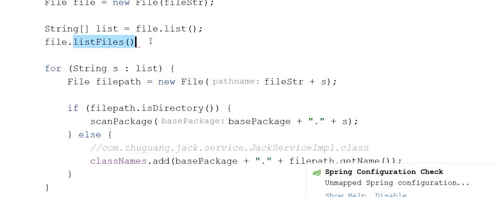

###  component-scan 标签解析和bean实例化初探


1、compoent-scan标签解析

2、自定义标签实战

3、bean实例化流程


@Component

@Service

@Controller

@Repository

@Configuration


doscan:

1. 去扫描基本包的路径， 找.class文件

2. 递归找.class文件

3. 判断.class文件里面是否有注解，includeFilter里面的注解

4. 变成BeanDefinition对象

   


------




------


```
ScannedGenericBeanDefinition
```


------


```
ConfigurationClassPostProcessor
```

```
AutowiredAnnotationBeanPostProcessor
```

```
CommonAnnotationBeanPostProcessor
```


scan-bean


可以自定义注解，也可以借助spring方法、


registtry  beanfactory

https://blog.csdn.net/luoyang_java/article/details/105835112
