###  **BeanPostProcessor 实例化、事件源码和Bean实例化初探**

1. BeanPostProcessor实例化
2. 事件源码
3. Bean实例化初探


把之前用JFInal框架的工程，改变成一个spring框架的工程，意味着每一个需要实例化的类都要加上一个

@Service注解


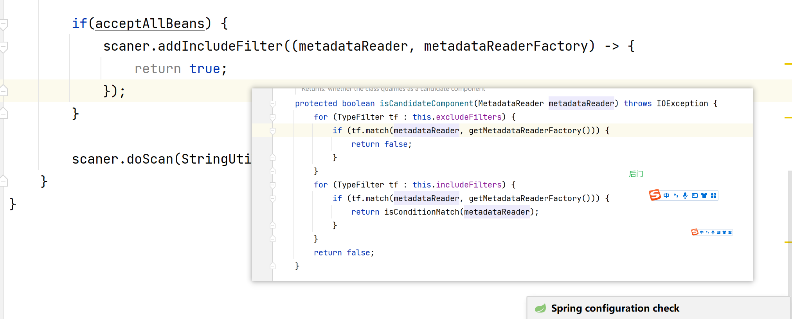

------

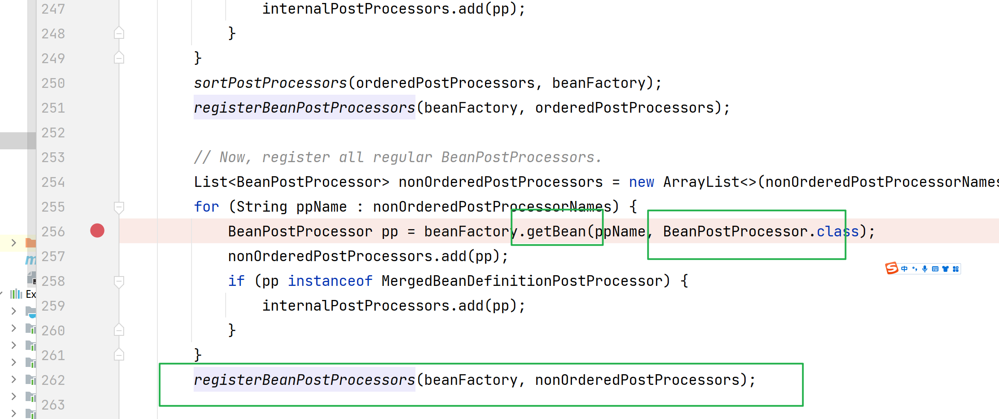

```
把实现了BeanPostProcessor接口的类实例化，并且加入到BeanFactory中
```

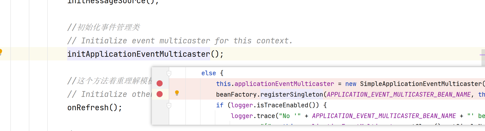

------

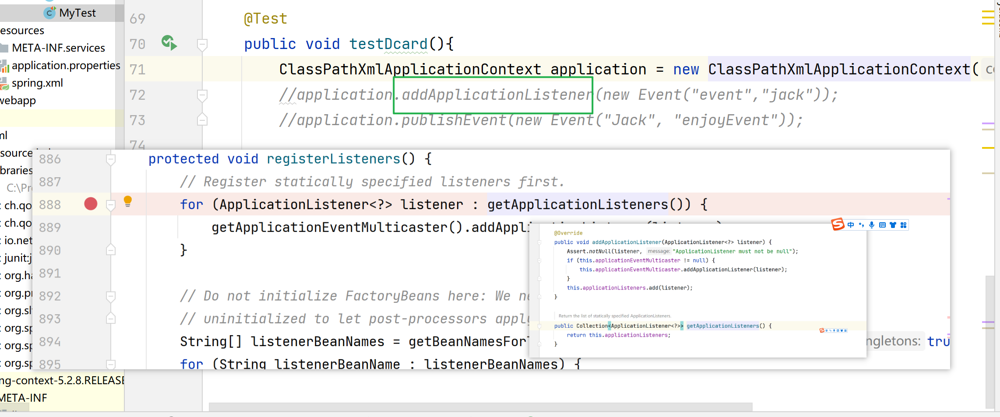

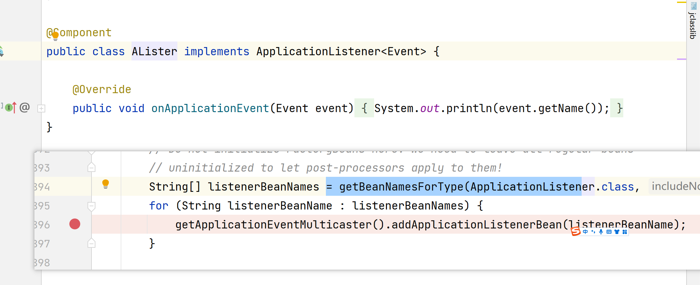

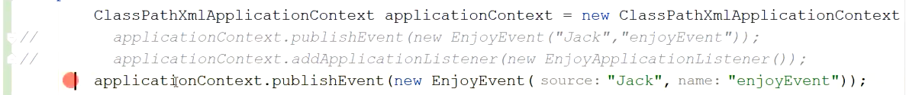

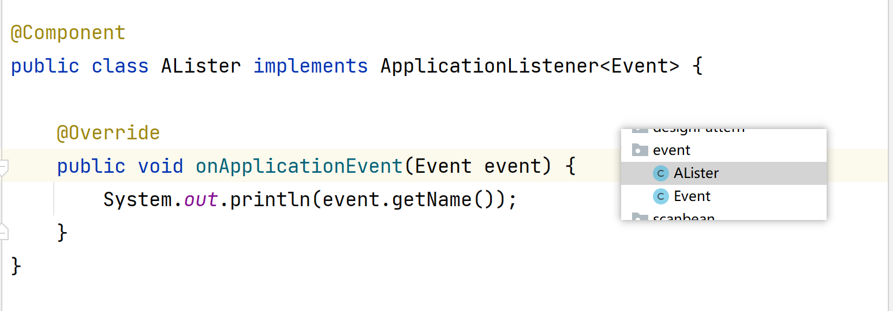

作为观察者来说。

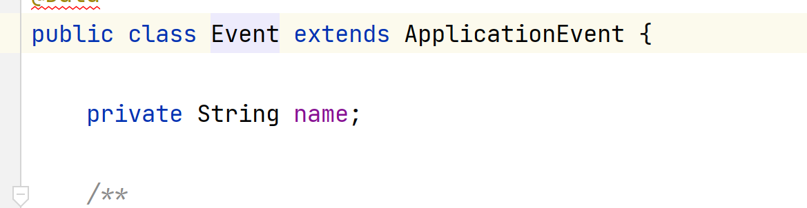

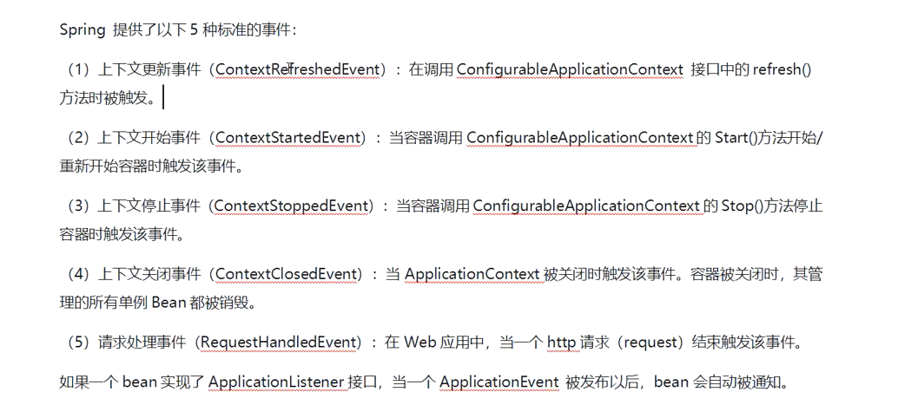


有些代码阻塞容器启动。

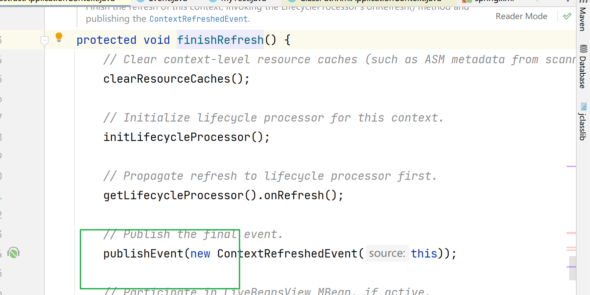


容器启动后，触发事件

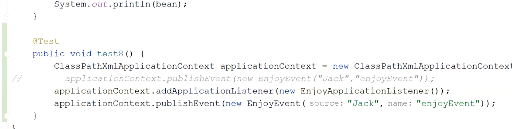

------

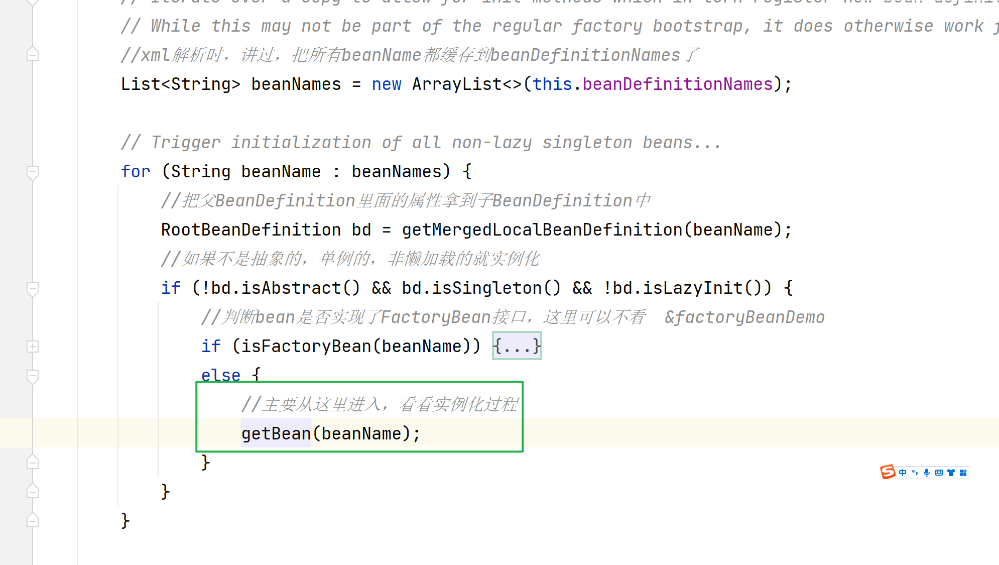


实例化----dependon  底层的支持。