###  bean的实例化和注解的收集

1. factoryMethod方式实例化
2. 有参和无惨构造函数实例化
3. @Autowired@Value@Resource 等注解的收集。

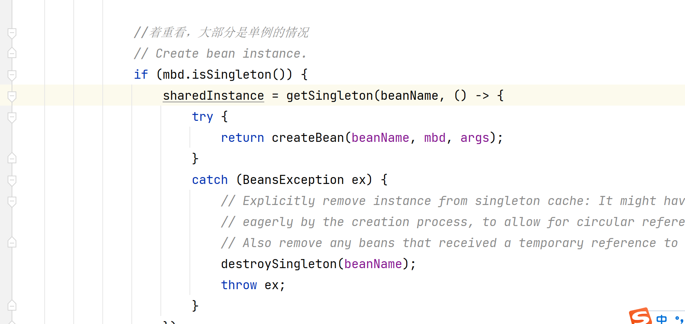

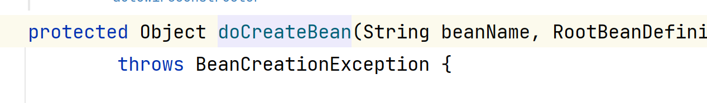

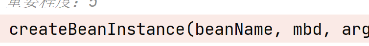

1、实例化factoryMethod方法对应的实例

​        @Bean注解

​        <bean>标签里面配置了factory-method属性

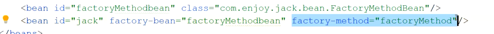

2、实例化带有@Autowired注解的构造函数

3、实例化没有@Autowired的有参构造函数

4、实例化无参构造函数

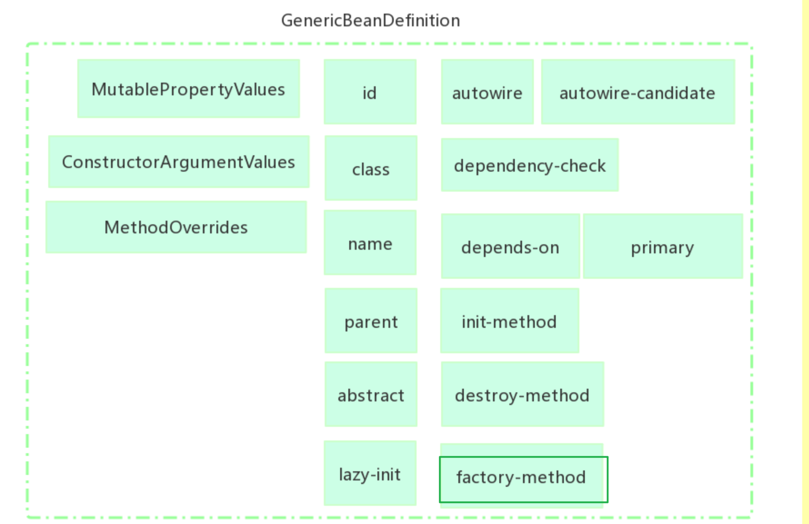

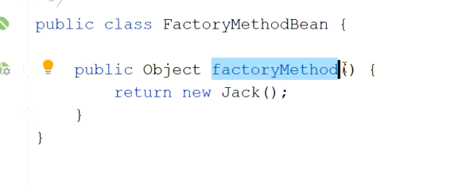

非静态

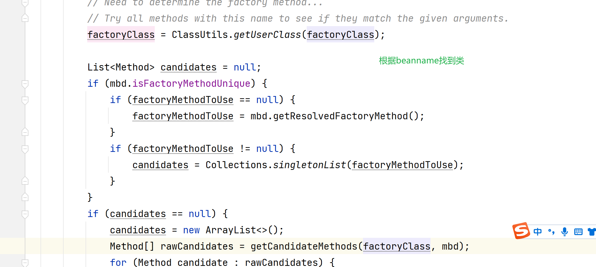

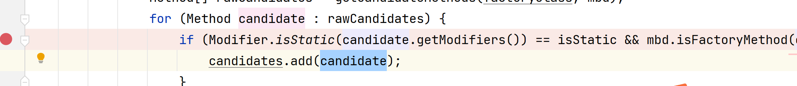

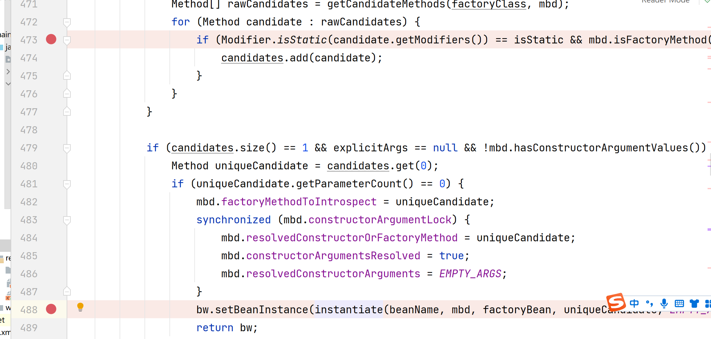

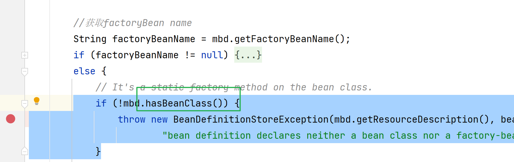

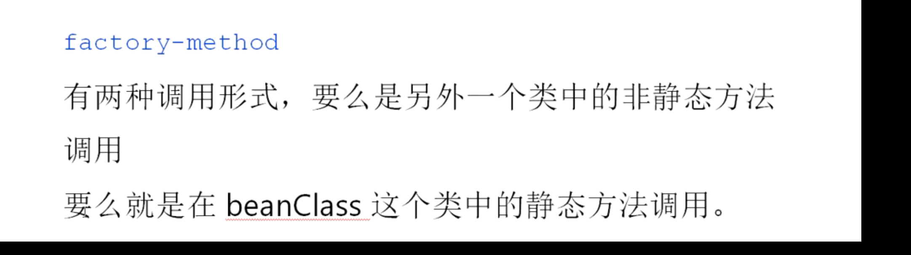

------

Autowired注解的方法或者属性都会触发getBean操作。

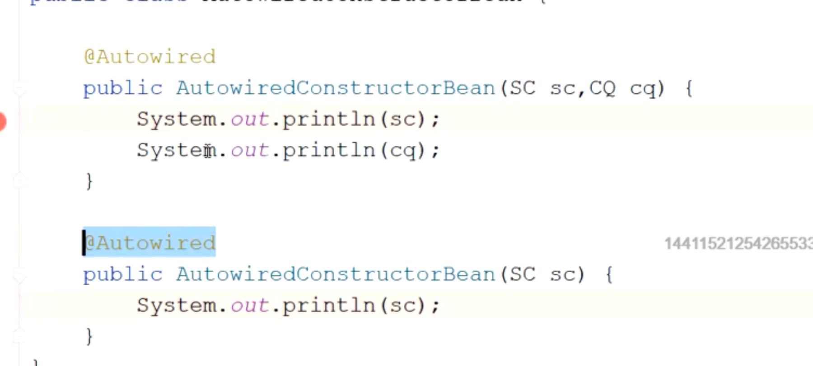

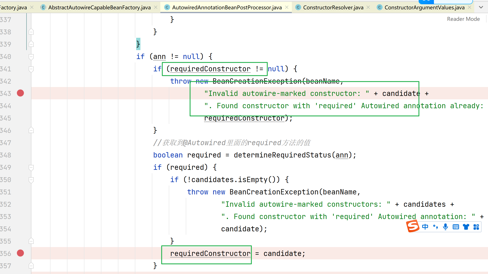

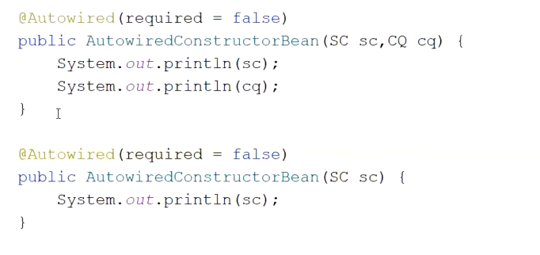

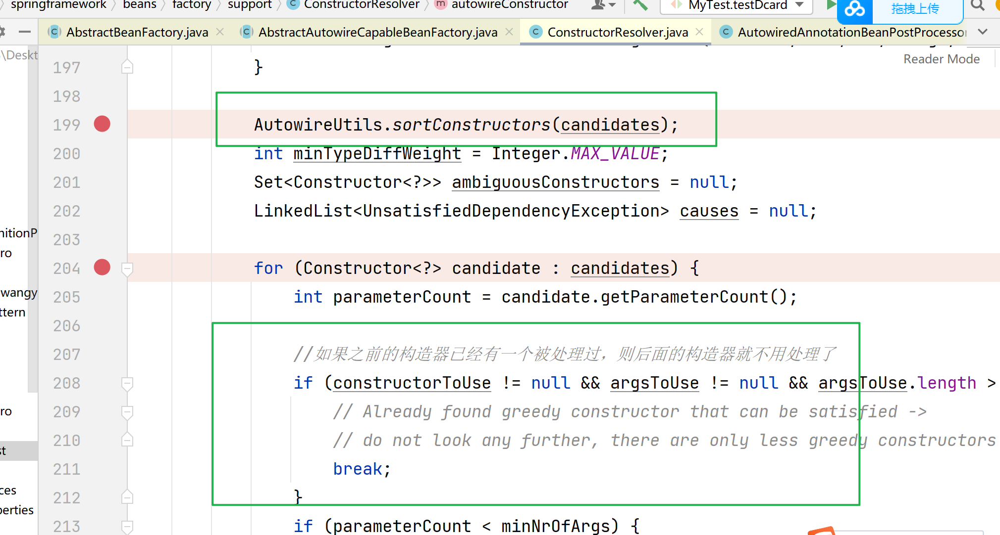

------

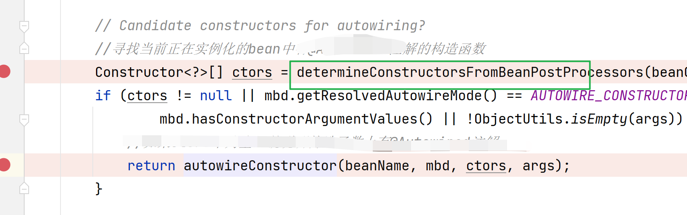
