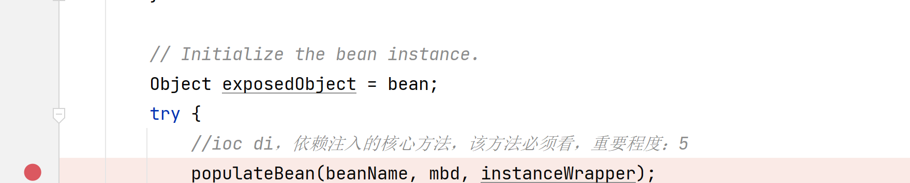
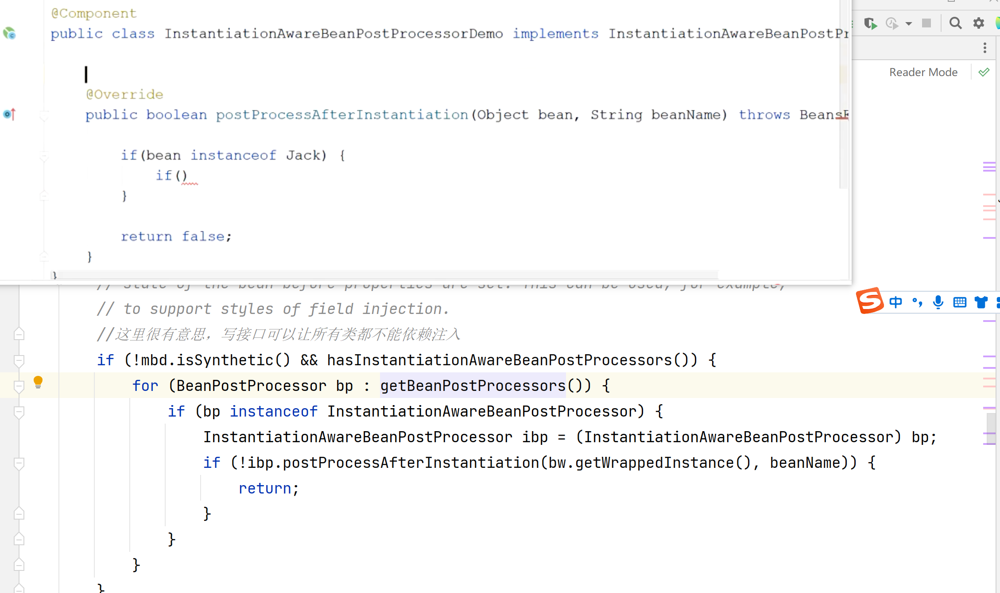
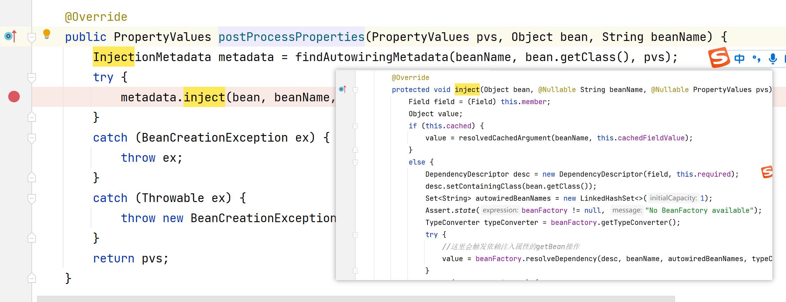
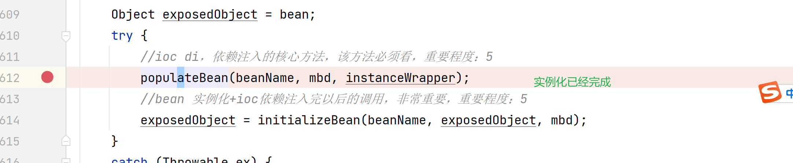
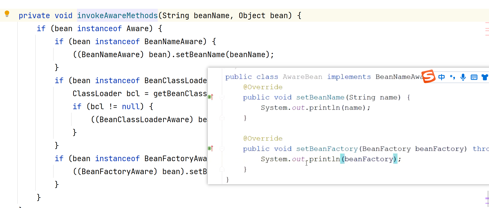
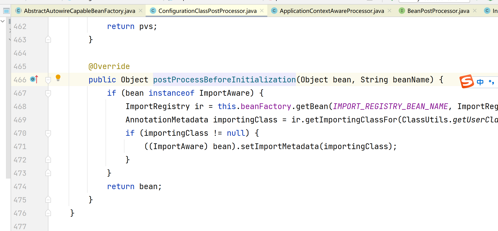
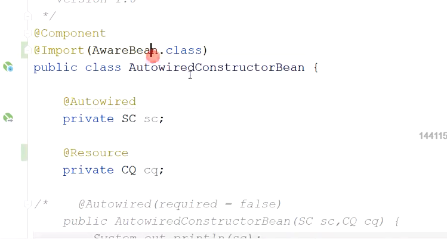
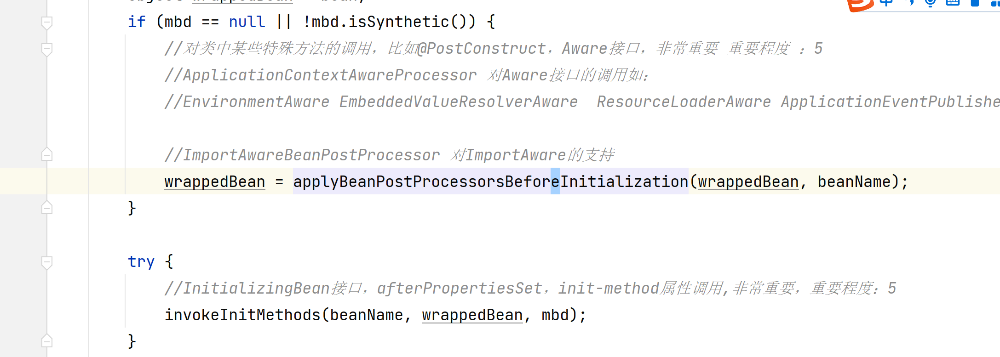
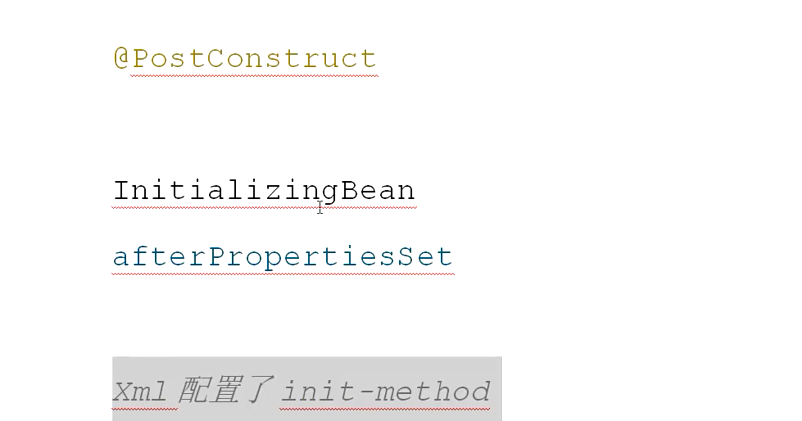

### 6、@Autowired @PostConstruct@PreDestroy注解.

### 6、@Autowired @PostConstruct@PreDestroy注解.

1. @Autowreid和@Resource的依赖注入
2. init-method和@PostConstruct@PreDestroy
3. 各种Aware接口的调用
4. 循环依赖详解

当满足条件。才会依赖注入。   依赖注入出问题了，找依赖注入相关代码。

引用数据类型的依赖注入会触发getBean操作。

拿到引用类的所有注解。

------

核心流程埋点  beanpOST

