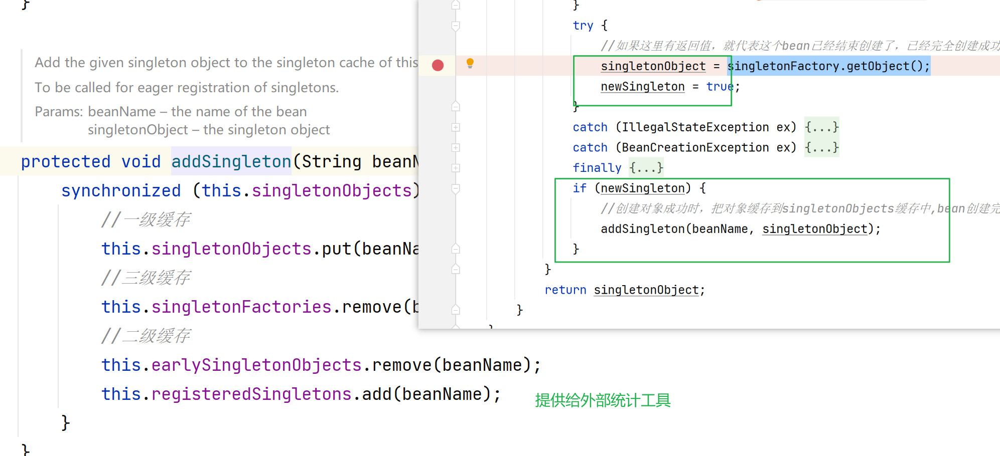

### 7、spring中循环依赖详解.

1. 单例循环依赖（可以）

2. 构造函数循环依赖（不行）

3. 多例循环依赖（不行）

   

   多例和懒加载的，手动用上下文调用 getBean'

   

   

装饰，调用

为什么扩展：因为依赖注入的对象可以修改。

B的代理对象  事务                     

二级缓存目的：        当循环依赖有超过两次同一个对象getbean时用到。

   

------

构造函数循环依赖：

发现A已经存在。

