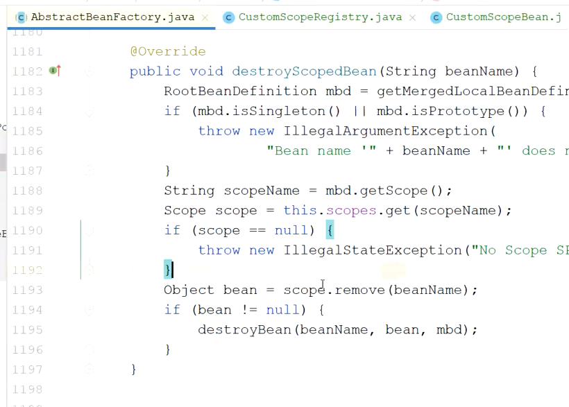

### 自定义scope和factoryBean

1. factoryBean接口
1. 自定义scope
1. @PropertySource
1. @CompoentScan


;

    @Override
    public Object get(String name, ObjectFactory<?> objectFactory) {
        if(local.get() != null) {
            return local.get();
        } else {
            //创建实例
            Object object = objectFactory.getObject();
            local.set(object);
            return object;
        }
    }

    @Override
    public Object remove(String name) {
        Object o = local.get();
        local.remove();
        return o;
    }

    @Override
    public void registerDestructionCallback(String name, Runnable callback) {

    }

    @Override
    public Object resolveContextualObject(String key) {
        return null;
    }

    @Override
    public String getConversationId() {
        return null;
    }
}

```




什么时候注册进去的、


